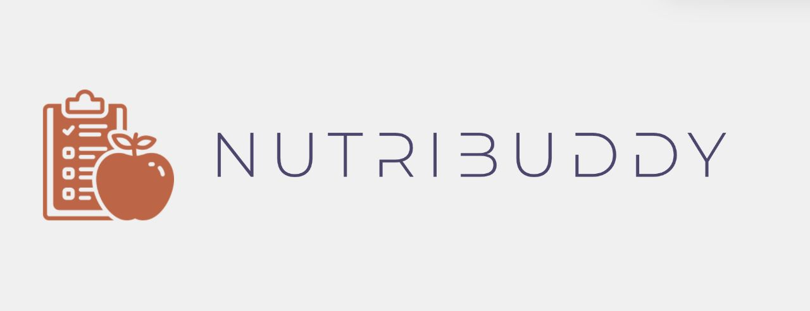
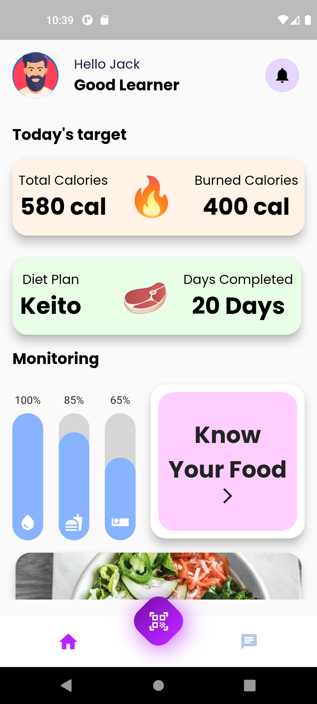
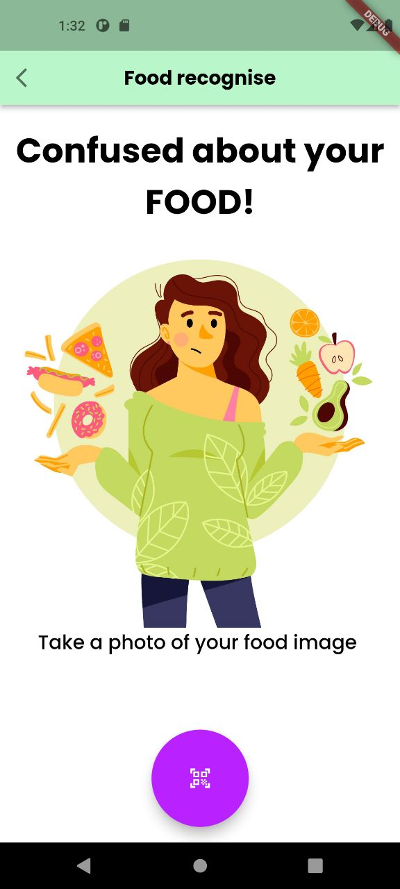
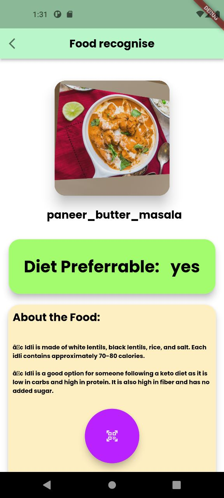

# NutriBuddy
<h1 align="center">
   
  
   
  NutriBuddy
   
</h1>

<h3 align="center">Helping individuals to eat right not eat less</h3>

## About

This project was created for HACK SRM by Team Mark 10 

## Team Members:

- [Goutham C Arun](https://github.com/GouthamCArun)
- [Alfred Jimmy](https://github.com/alffy007)
- [Athul Babu](https://github.com/ATHULB04)
- [Kevin Oommen](https://github.com/KevinOommen)

  <a href="#problem-helpnow-solves">Problem Statement</a> •
   <a href="#solution">Solution</a> •
  <a href="#tech-stacks-used">Tech-Stacks used</a> •

  

## The Problem We Solve: Transforming your diet, one byte at a time
Many people struggle to maintain a healthy diet due to various reasons such as lack of time, knowledge, and motivation. This often leads to unhealthy eating habits, weight gain, and other health-related issues. Additionally, it can be challenging for individuals to determine if the food they are consuming is appropriate for their dietary goals.

Our solution is to develop an app that takes care of diet plans and uses AI to help the user to achieve their dietary goals. The app will use computer vision to help the user to check if the food captured fits their diet. The app will provide personalized meal plans based on the user's dietary preferences, health goals, and food allergies, if any. The app will also track the user's progress and provide recommendations to improve their diet.

The app will help users make informed decisions about their food choices, improve their eating habits, and achieve their dietary goals. By using AI and computer vision, the app will provide accurate and reliable information to the users, making it easier for them to maintain a healthy diet.
## Solution
Our solution will be a mobile application that utilizes Firebase, computer vision using TensorFlow, and ChatGPTs APIs to help users achieve their dietary goals. The app will have the following features:

### 1. Personalized Meal Plans
The app will provide personalized meal plans based on the user's dietary preferences, health goals, and food allergies, if any. The meal plans will be created using Firebase's real-time database and will be updated regularly based on the user's progress.

Firebase Real-time Database will be used to store user data and meal plans.

### 2. Computer Vision for Food Recognition
The app will use computer vision to help the user check if the food captured fits their diet. The app will use TensorFlow's image recognition capabilities to identify the food captured by the user and provide information about its nutritional value.

TensorFlow will be used to implement the image recognition feature.

### 3. Chatbot for Dietary Recommendations
The app will have a chatbot that will provide dietary recommendations to the user. The chatbot will use ChatGPTs APIs to provide personalized recommendations based on the user's dietary goals.

ChatGPTs APIs will be used to implement the chatbot feature.

### 4. Progress Tracking
The app will track the user's progress and provide recommendations to improve their diet. The app will also provide users with insights into their eating habits and suggest changes to help them achieve their dietary goals.

Firebase Real-time Database will be used to store user progress data and provide insights.

Overall, our solution will help users make informed decisions about their food choices, improve their eating habits, and achieve their dietary goals. By using AI and computer vision, the app will provide accurate and reliable information to the users, making it easier for them to maintain a healthy diet.

### Railway for Hosting
Furthermore, for hosting our project, we chose Railway. Railway is a cloud platform that simplifies the deployment and management of web applications. By utilizing Railway for hosting, we were able to easily deploy our project and make it accessible to users over the internet. Railway's user-friendly interface and seamless setup process allowed us to integrate our project with their platform effortlessly. With Railway, we benefit from reliable hosting infrastructure and automatic scaling, ensuring that our application can handle incoming traffic effectively. 
 
    
    
    
    
     
# TECH STACKS USED

<h3> 
  1.Flutter 
   
  2.ChatGPT with LangChain
   
 3.FIREBASE Authentication
   
 4.Django (Backend for API calls)
   
 5.RAILWAY
   
 6.TensorFlow lite(for native image recognition capability)
   
  
</h3>

